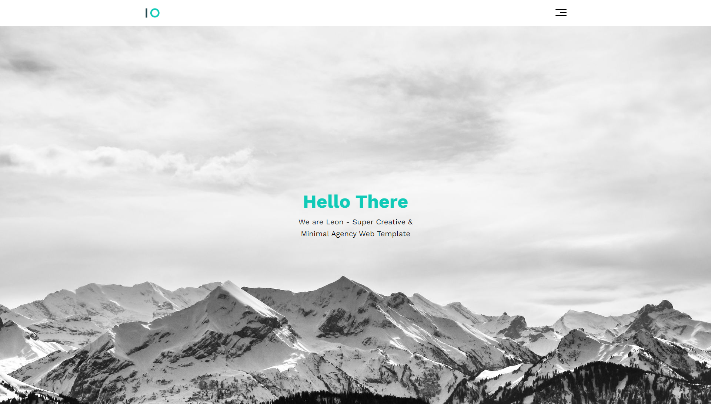
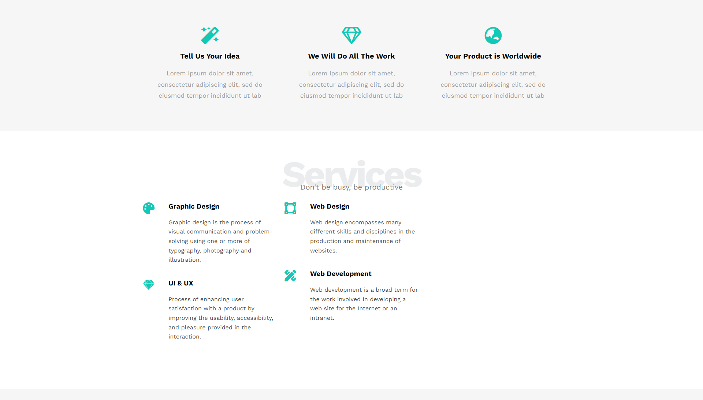
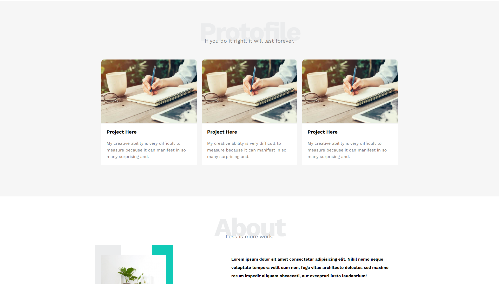
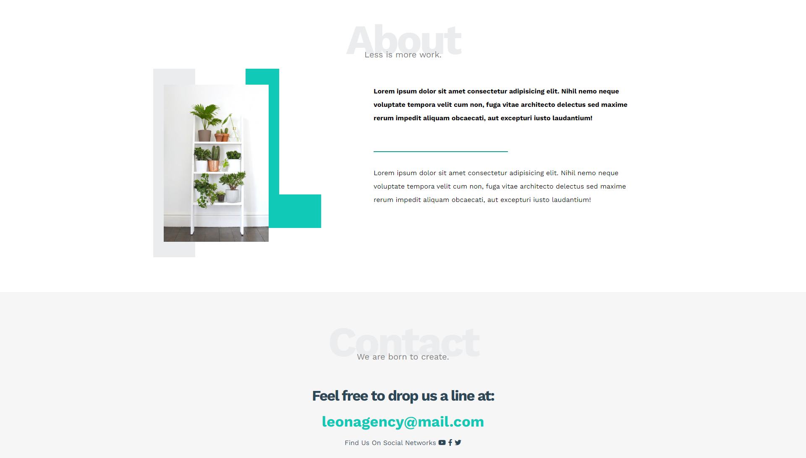
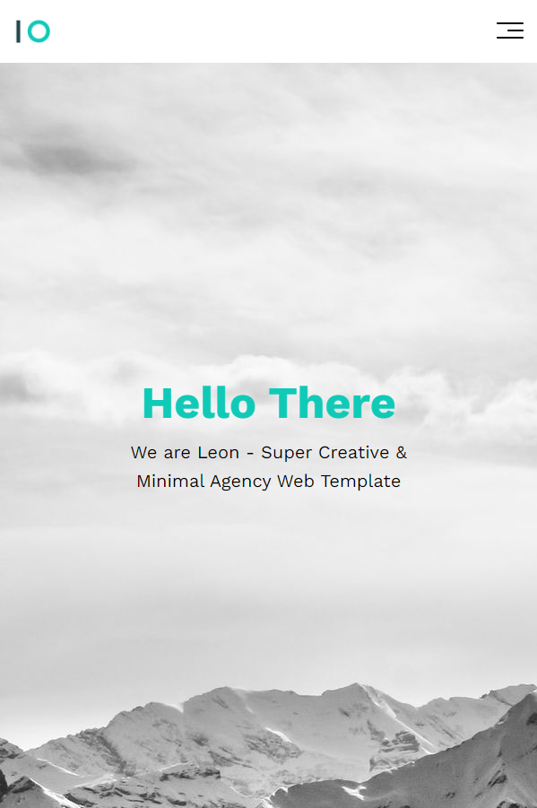
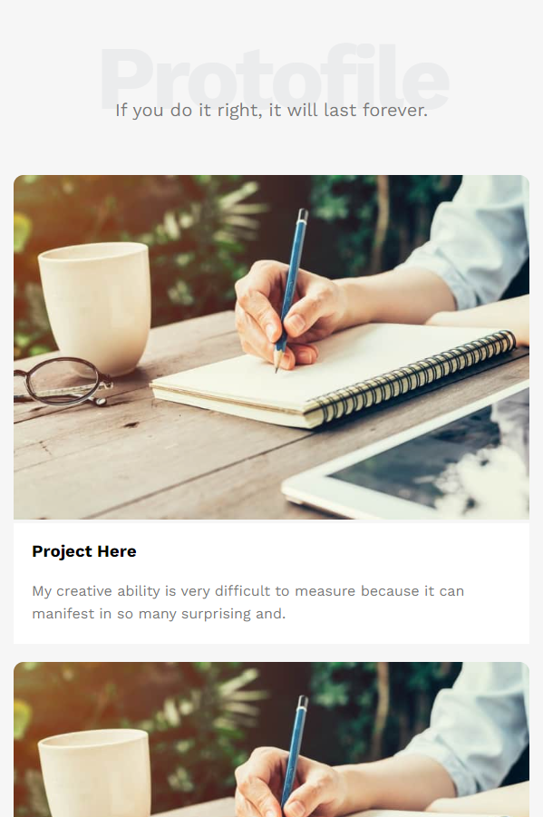
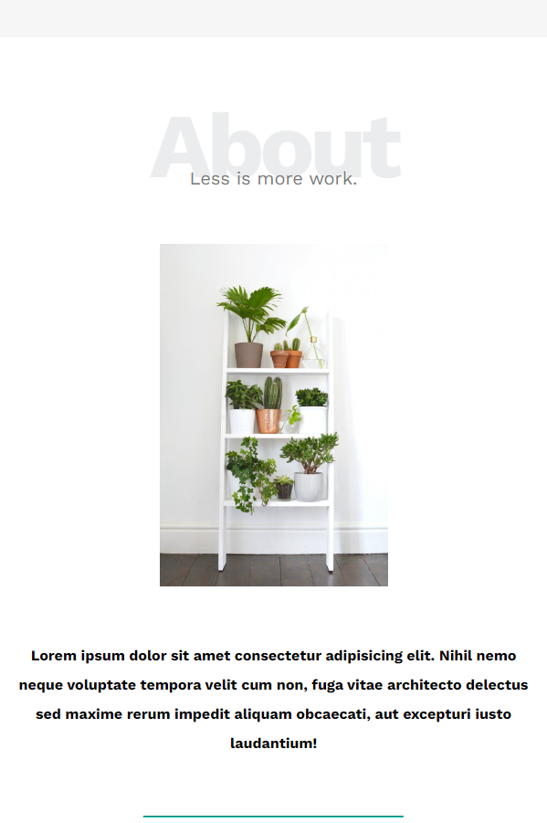
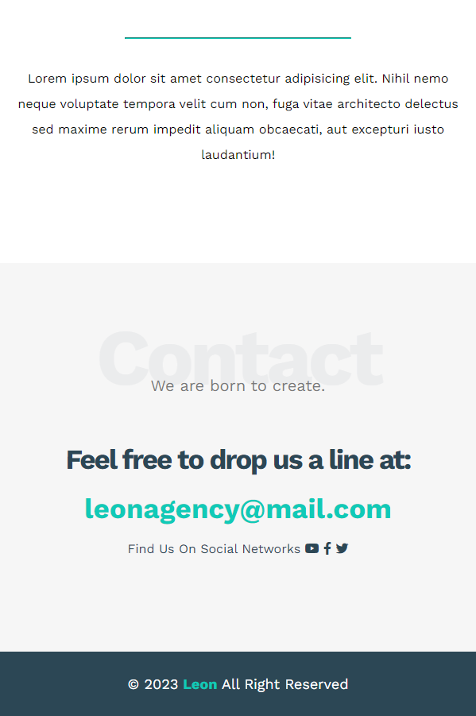

## Leon

Landing Page for Technical company 👨‍💻

### Skills Needed :

*   Html
*   Css ( Grid Layout Module , Flexbox , Media Queries )

### Screenshots

#### Web

---

#### Mobile

<table>
  <tr>
    <th>Home</th>
    <th>Features</th>
  </tr>
  <tr>
    <td>
     

        
      
 
    </td>
   <td>
     

        
      
 
    </td>
  </tr>
    <tr>
    <th>Services</th>
    <th>Portfolio</th>
  </tr>
  <tr>
    <td>
     

        
      
 
    </td>
   <td>
     

        
      
 
    </td>
  </tr>
   </tr>
    <tr>
    <th>About</th>
    <th>Contact Us</th>
  </tr>
  <tr>
    <td>
     

        
      
 
    </td>
   <td>
     

        
      
 
    </td>
  </tr>
</table>

